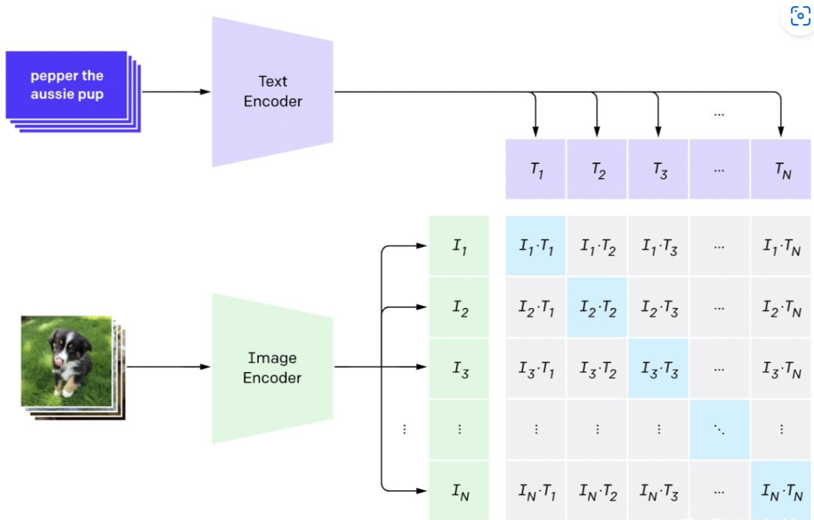

# CLIP模型
全称：**Contrastive Language-Image Pre-training**，一种基于对比文本-图像对的预训练方法。

CLIP是一种基于对比学习的多模态模型，其训练数据是**文本-图像对**：一张图像和它对应的文本描述，目标是通过对比学习，模型能够学习到文本-图像对的匹配关系。

结构包括两部分：**Text Encoder**、**Image Encoder**。

**Text Encoder**：目的是提取文本特征，可以用NLP常用模型，例transformer模型。

**Image Encoder**：目的是提取图像特征，可以用ViT或CNN模型。

<figure>
  
  <figcaption></figcaption>
</figure>

对比学习体现在文本特征和图像特征进行对比，一次batch**输入N个文本-图像对**，生成N个文本特征、N个图像特征，所有特征全连接生成大小为 N2 的矩阵（上图中矩阵），矩阵中每个值通过**计算文本特征和图像特征的余弦相似性**来代表文本-图像对的相似度。

**正样本**：N个原始匹配的文本-图像对，即矩阵对角线。

**负样本**：除正样本外，剩余的N2-N个样本为负样本。

训练目标：**最大化正样本相似度，最小化负样本相似度。**