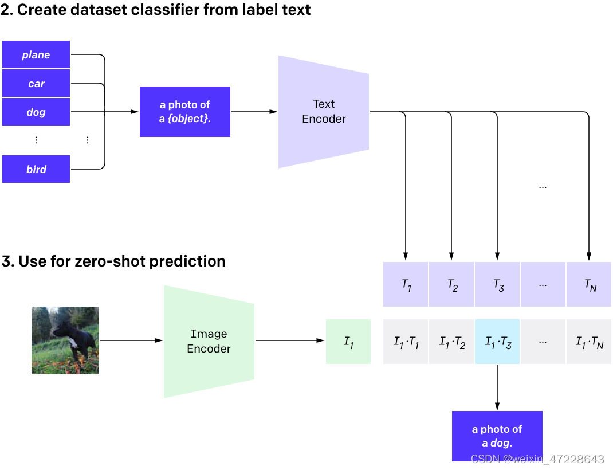

# CLIP模型
全称：**Contrastive Language-Image Pre-training**，一种基于对比文本-图像对的预训练方法。

CLIP是一种基于对比学习的多模态模型，其训练数据是**文本-图像对**：一张图像和它对应的文本描述，目标是通过对比学习，模型能够学习到文本-图像对的匹配关系。

结构包括两部分：**Text Encoder**、**Image Encoder**。

**Text Encoder**：目的是提取文本特征，可以用NLP常用模型，例transformer模型。

**Image Encoder**：目的是提取图像特征，可以用ViT或CNN模型。

<figure>
  
  <figcaption></figcaption>
</figure>


对比学习体现在文本特征和图像特征进行对比，一次batch**输入N个文本-图像对**，生成N个文本特征、N个图像特征，所有特征全连接生成大小为 N<sup>2</sup> 的矩阵（上图中矩阵），矩阵中每个值通过**计算文本特征和图像特征的余弦相似性**来代表文本-图像对的相似度。

**正样本**：N个原始匹配的文本-图像对，即矩阵对角线。

**负样本**：除正样本外，剩余的N<SUP>2</SUP>-N个样本为负样本。

训练目标：**最大化正样本相似度，最小化负样本相似度。**

# CLIP对未知类别预测三阶段
**1、Contrastive pre-training**：预训练阶段，使用使用互联网收集的约4亿个文本-图像对进行对比学习训练。（不需要手工标注，进行自监督训练）

**2、Create dataset classifier from label text**：对于给定数据集，提取待预测类别文本特征。以ImageNet数据集1000个类别为例，原始的类别为单词，CLIP文本编码器输入为句子，因此使用 A photo of a {object}. 的提示模板作为输入，之后提取特征，生成1000维特征向量。

<figure>
  
  <figcaption></figcaption>
</figure>


**3、Use for zero-shot predictiion**：进行零样本学习（Zero-Shoot） 推理预测。以ImageNet为例，对于输入图像，使用图像编码器提取其图像特征。之后与1000维文本特征进行相似度计算，最高值即为预测结果。

# 编码实现
openai开源地址：https://github.com/openai/CLIP

**主要流程部分代码：**
```python
import os
import clip
import torch
from torchvision.datasets import CIFAR100

# Load the model
device = "cuda" if torch.cuda.is_available() else "cpu"
model, preprocess = clip.load('ViT-B/32', device)

# dataset 下载
cifar100 = CIFAR100(root=os.path.expanduser("~/.cache"), download=True, train=False)

# Prepare the inputs
image, class_id = cifar100[3637]
image_input = preprocess(image).unsqueeze(0).to(device)
text_inputs = torch.cat([clip.tokenize(f"a photo of a {c}") for c in cifar100.classes]).to(device)

# Calculate features
with torch.no_grad():
    image_features = model.encode_image(image_input)
    text_features = model.encode_text(text_inputs)

# Pick the top 5 most similar labels for the image
image_features /= image_features.norm(dim=-1, keepdim=True)
text_features /= text_features.norm(dim=-1, keepdim=True)
similarity = (100.0 * image_features @ text_features.T).softmax(dim=-1)
values, indices = similarity[0].topk(5)

# Print the result
print("\nTop predictions:\n")
for value, index in zip(values, indices):
    print(f"{cifar100.classes[index]:>16s}: {100 * value.item():.2f}%")
```
