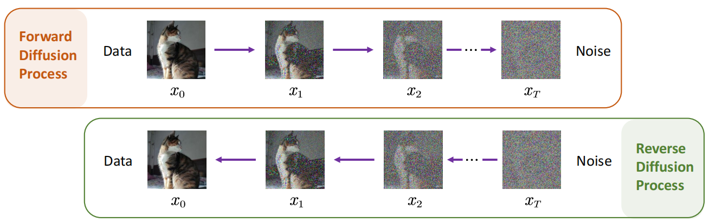
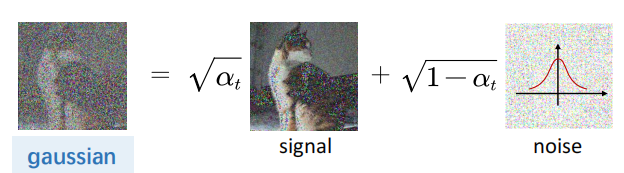
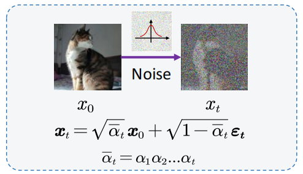
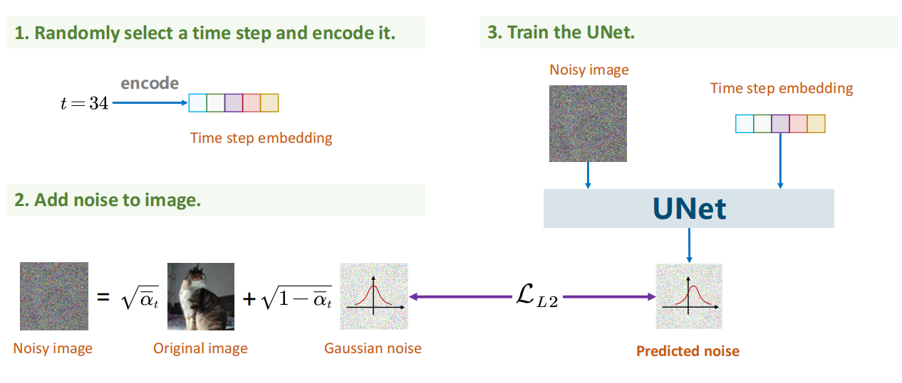
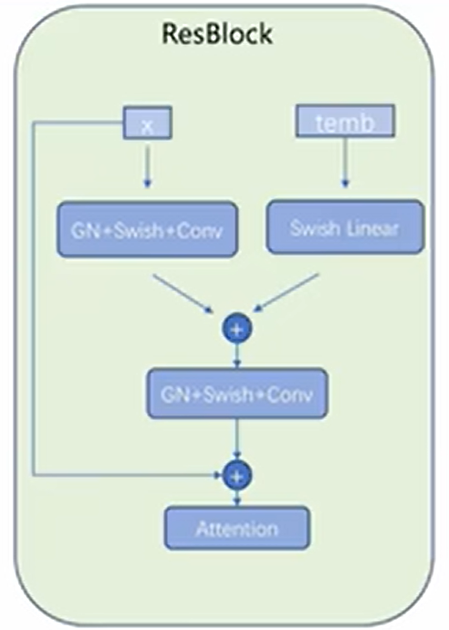
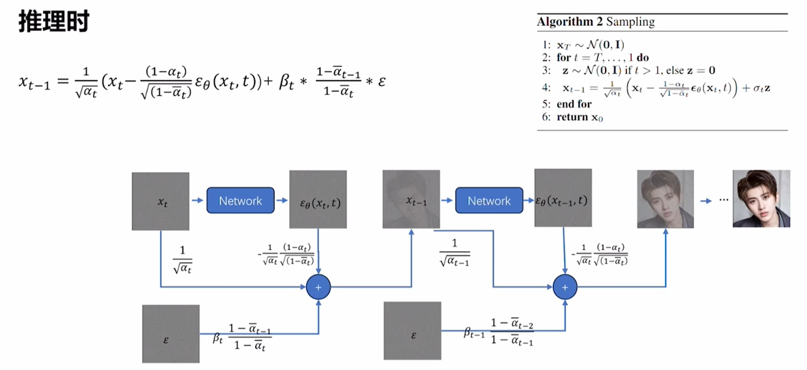
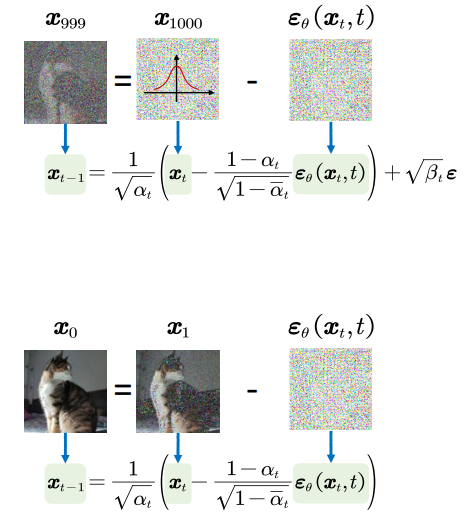

# Diffsion模型
2020年，DDPM（Denoising Diffusion Probabilistic Model）被提出，被称为扩散模型（Diffusion Model）。分为两个阶段：前向加噪、反向去噪。

***TIPS:*** 高斯分布图中的每个像素值都是独立从高斯分布中随机生成，由于所有像素值独立同分布，噪声图的整体像素值分布自然符合高斯分布，绘制所有像素值的直方图会近似于钟形曲线。

## 加噪
对给定图像$X_{0}$，逐步加噪，直至为完全噪声图像$X_{T}$。

对任意时刻$X_{t-1}$加噪至$X_{t}$，过程如下：

经公式推导，对于任意$X_{t}$，可以由$X_{0}$、$t$直接推导，（$t$为常数，DDPM中设置为0~1000）。$α$是噪声调度参数，取值为0~1，随$t$递减，表示原始数据所占比例，随时间$t$逐渐减少，噪声比例越来越大。$\epsilon_{t}$为时间步$t$时刻添加的噪声。

## 去噪
去噪过程就是对全噪声图像$X_{T}$逐步去噪，最终实现图像还原的过程。

加噪过程中，向$X_{t-1}$加入噪声生成至$X_{t}$。去噪过程就是对给定$X_{T}$，减去前向过程中向$X_{t-1}$加入的噪声，因此，关键是**怎么得到加入的噪声**。

解决方案是可以用深度学习来**拟合这种加入的噪声**。具体为使用UNet网络，将噪声图像以及时间步$T$作为输入，输出目标是尽可能拟合加入的噪声图像。损失函数的目标就是**优化模型预测噪声与原加入噪声的最大似然估计**（Maximum Likelihood Estimation）。

## 训练阶段Training

训练阶段，本质上是对UNet模型进行训练，目标是模型的输出与原加入噪声匹配。

***TIPS***:训练UNet时，时间步$temb$的嵌入是在UNet网络中每个block里面都进行（下图）。
<figure>
  
</figure>

## 推理阶段Sampling

1、推理阶段，输入加噪后的完全噪声图像$X_{T}$，利用训练后的UNet网络进行噪声预测。

2、之后将$X_{T}$减去预测噪声，并加入新的高斯分布$\epsilon$（目的是为了将$X_{T-1}$也符合高斯分布），得出$X_{T-1}$。对于上图中的公式：
$$ 
x_{t-1} = \frac{1}{\sqrt{\alpha_t}} \left( x_t - \frac{1 - \alpha_t}{\sqrt{1 - \overline{\alpha}_t}} \varepsilon_\theta(x_t, t) \right) + \beta_t \cdot \frac{1 - \overline{\alpha}_{t-1}}{1 - \overline{\alpha}_t} \cdot \varepsilon 
$$
其中，
$$ 
\frac{1}{\sqrt{\alpha_t}} \left( x_t - \frac{1 - \alpha_t}{\sqrt{1 - \overline{\alpha}_t}} \varepsilon_\theta(x_t, t) \right) 
$$ 
就是将$X_{t}$减去预测噪声。

3、循环上述步骤（$Algorithm2$中的$for$ $t$=$T$...,1 $do$），最终得出目标图像。需要注意的是，在输出最终的$X_{0}$，不引入新的高斯分布（下图所示）。

