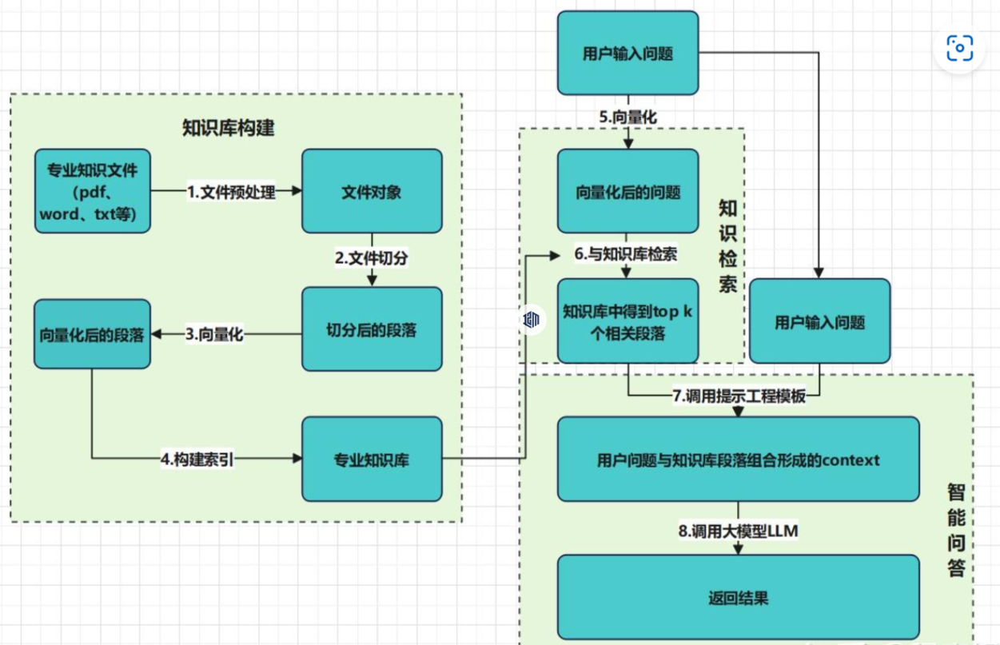

# RAG 检索增强生成
**RAG（Retrieval-Augmented Generation）**：通过外部知识库检索用户输入相关信息，生成LLM提示，以此辅助大语言模型生成更准确、更丰富的文本内容。

**检索**：从本地知识库中检索用户输入相关信息。知识库本质是一个列表，其中包含N个多维向量。

**增强**：将检索到的信息作为LLM的输入，增强模型对特定问题的理解和回答能力。对检索到的相关信息，与用户输入问题结合，生成更丰富、准确、符合用户需求的LLM提示。

**生成**：使用增强后的提示作为LLM上下文输入，生成更优质回复。

<figure>
  
</figure>

## 知识库构建
数据来源：