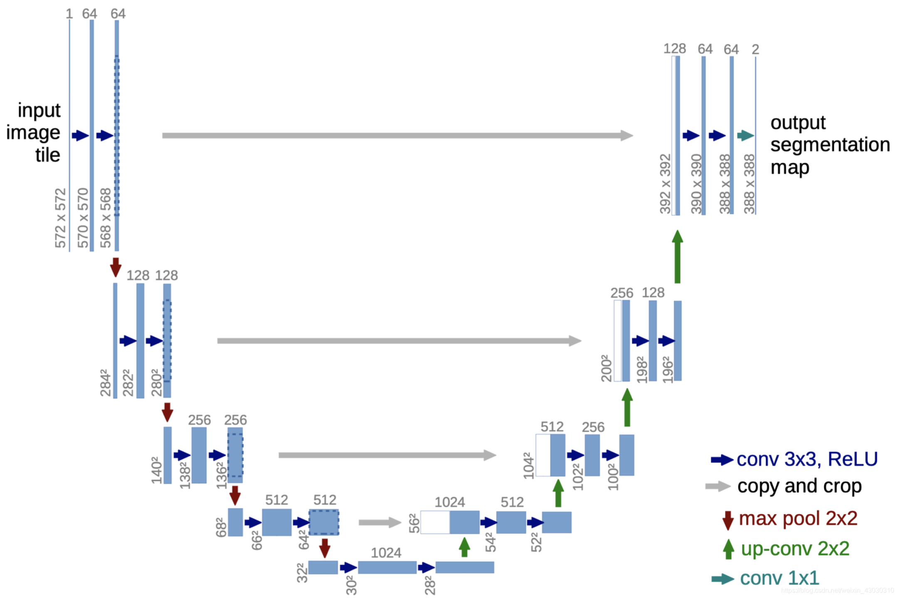
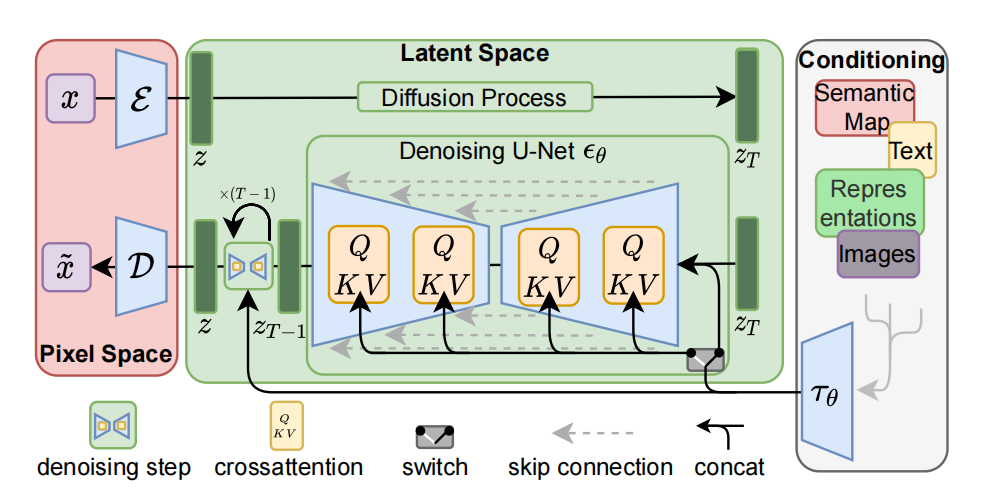

# U-Net网络
U-Net网络：**扩散模型中使用的骨干网络**， 是一种对称的Encoder-Decoder(编码器-解码器)架构。

*每个卷积核的通道数必须与输入数据的通道数相同，而多个卷积核的组合可以生成多个输出通道。*

**左半部分：** Encoder（Diffusion中的压缩）负责对输入进行**特征提取**，可由EfficientNet、ResNet等网络构建。

**右半部分：** Decoder（Diffusion中的去噪）负责将feature map**恢复至原始分辨率**，其构架也可由EfficientNet、ResNet等网络构建。

<figure style="text-align: center; margin: 0 auto;">
  
  <figcaption>图1 U型架构图示意</figcaption>
</figure>

在Encoder和Decoder两个模块之间，使用skip-connection作为桥梁，用于特征融合，将浅层的位置信息与深层的语义信息进行concat操作。图中用灰色箭头表示skip-connection，其中“copy”就是concat通道拼接操作，而“crop”则通过裁剪使得两个特征图尺寸一致。

# U-Net网络在Diffusion中的作用
<figure>
  
  <figcaption>图2 Diffusion流程</figcaption>
</figure>

U-Net是Stable Diffusion中的核心模块,主要在“扩散”循环中对高斯噪声矩阵进行**迭代降噪**，并且每次预测的噪声都由文本和timesteps进行引导，将预测的噪声在随机高斯噪声矩阵上去除，最终**将随机高斯噪声矩阵转换成图片的隐特征。**

*Tip:**隐特征**（Latent Features） 是数据在低维潜在空间（Latent Space）中的抽象表示,人话就是原始数据通过某种**映射转化后的低维向量**或张量。*

作用：随机高斯噪声矩阵 ——> 在引导下对矩阵进行迭代降噪 ——> 输出即图片隐特征

注意：U-Net的**输出是预测的噪声**，而非直接生成图像。通过从初始高斯噪声中逐步减去预测噪声，最终得到去噪后的潜在特征 ，随后由解码器生成图像。
